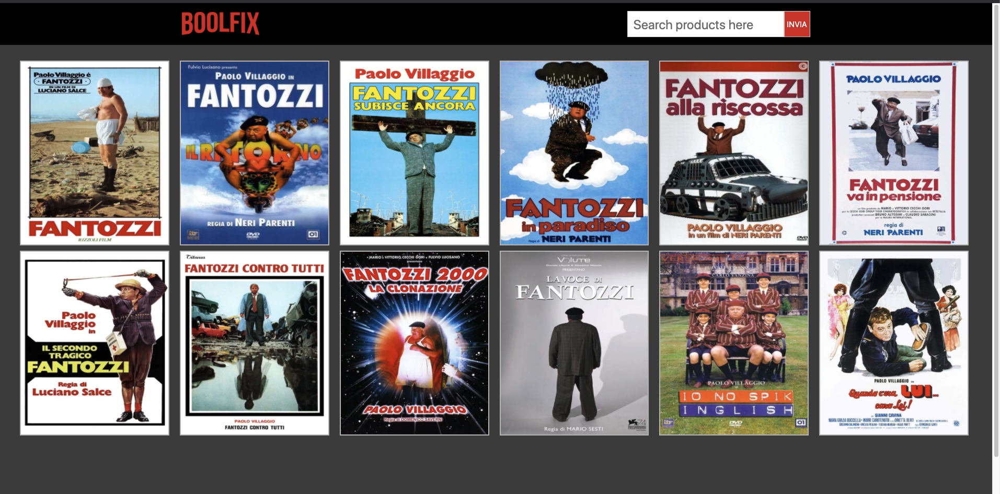

# 	BOOLFIX: A replica of Netflix ## 

> 
>
> ##### *:open_file_folder: File Name*:  ajax-ex-boolflix :open_file_folder:
>
> 

### :man_teacher: *BOOL TASK* 

**Milestone 1:** 

Creare un layout base con una searchbar (una input e un button) in cui possiamo scrivere completamente o parzialmente il nome di un film. Possiamo, cliccando il bottone, cercare sull’API tutti i film che contengono ciò che ha scritto l’utente.Vogliamo dopo la risposta dell’API visualizzare a schermo i seguenti valori per ogni film trovato: TitoloTitolo OriginaleLingua OriginaleVoto (media)Utilizzare un template Handlebars per mostrare ogni singolo film trovato.

**Milestone 2:**

Trasformiamo il voto da 1 a 10 decimale in un numero intero da 1 a 5, così da permetterci di stampare a schermo un numero di stelle piene che vanno da 1 a 5, lasciando le restanti vuote (troviamo le icone in FontAwesome).Arrotondiamo sempre per eccesso all’unità successiva, non gestiamo icone mezze piene (o mezze vuote :P)Trasformiamo poi la stringa statica della lingua in una vera e propria bandiera della nazione corrispondente, gestendo il caso in cui non abbiamo la bandiera della nazione ritornata dall’API (le flag non ci sono in FontAwesome).
Riferimento templateTitolo: Barnyard - Ritorno al cortileTitolo Originale: Back at the BarnyardLingua: (bandiera o lingua)Voto: (stelle da 1 a 5)Tipo: Tv o Film
Allarghiamo poi la ricerca anche alle serie tv. Con la stessa azione di ricerca dovremo prendere sia i film che corrispondono alla query, sia le serie tv, stando attenti ad avere alla fine dei valori simili (le serie e i film hanno campi nel JSON di risposta diversi, simili ma non sempre identici)

**Milestone 3:** In questa milestone come prima cosa  faremo un refactor delle chiamate ajax creando un’unica funzione alla quale passeremo la url, la apy key, la query, il type, ecc… In questo modo potremo chiamare la ricerca sia con il keypress su enter che con il click.
Poi, aggiungiamo la copertina del film o della serie al nostro elenco. Ci viene passata dall’API solo la parte finale dell’URL, questo perché poi potremo generare da quella porzione di URL tante dimensioni diverse. Dovremo prendere quindi l’URL base delle immagini di TMDB: https://image.tmdb.org/t/p/ per poi aggiungere la dimensione che vogliamo generare (troviamo tutte le dimensioni possibili a questo link: https://www.themoviedb.org/talk/53c11d4ec3a3684cf4006400) per poi aggiungere la parte finale dell’URL passata dall’API.Esempio di URL che torna la copertina di Scrubs:
https://image.tmdb.org/t/p/w342/u1z05trCA7AuSuDhi365grwdos1.jpg

**Milestone 4:**Trasformiamo quello che abbiamo fatto fino ad ora in una vera e propria webapp, creando un layout completo simil-Netflix:Un header che contiene logo e search barDopo aver ricercato qualcosa nella searchbar, i risultati appaiono sotto forma di “card” in cui lo sfondo è rappresentato dall’immagine di copertina (*consiglio la poster_path con w342*)Andando con il mouse sopra una card (on hover), appaiono le informazioni aggiuntive già prese nei punti precedenti più la overview

### :computer: Languages and Libraries:

* HTML

* CSS

* JS

* jQuery

* Ajax

* Handlebars

  

### :desktop_computer: Project Preview:

> Visit My Github Profile to see other* __Projects__:man_technologist:

## 	https://github.com/AndreaDeMartino

